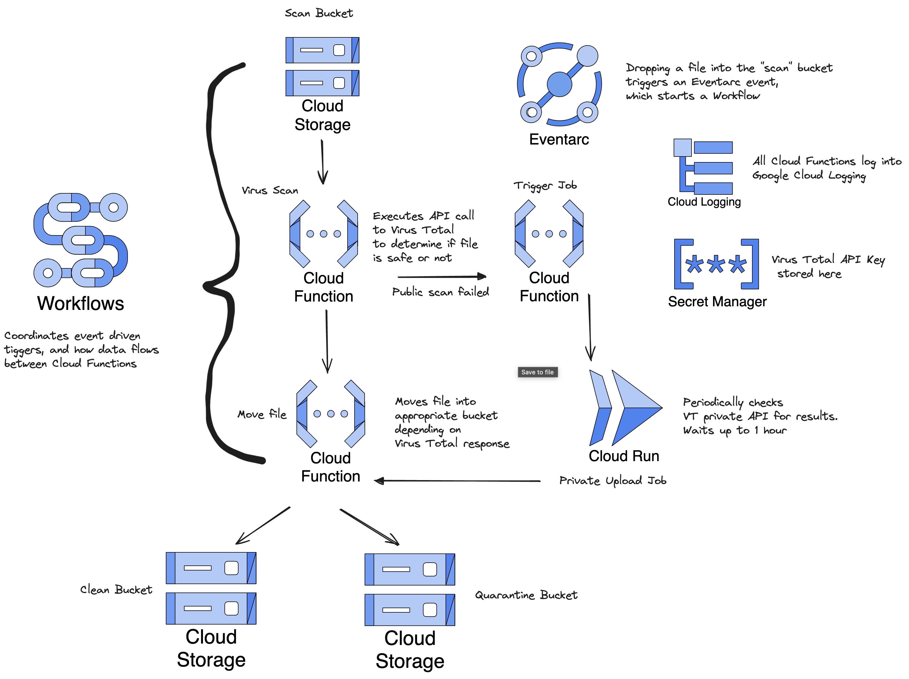

# README.md

This repo contains code and directions to set up a Google Cloud [Workflows](https://cloud.google.com/workflows?hl=en),
that integrates with [VirusTotal](https://www.virustotal.com/gui/home/upload) to scan files, and move them into
appropriate Storage Buckets. Two Cloud Functions,
written in [Ruby](https://www.ruby-lang.org/en/), do the various checks and API calls to VirusTotal in order
to determine if the files are safe. Once a determination has been made,
the file is moved into a "safe" or "quarantine" bucket. If we can't determine the status of the file,
we leave the in the original bucket.

Workflow architecture:


> [!NOTE]
> This workflow assumes that the file in question has already been uploaded and scanned by VirusTotal. We are then moving the file into a bucket based upon the results of the scan. IRL, one should check to see if the file has been scanned, and if it has not, then upload it to the VirusTotal website. After some time (usually minutes), the results will become available.

## Cloud Functions and Functions Framework

Cloud Functions are meant to be small chunks of code that are typicall event-driven in nature. Google has created a web framework that simplifies the boilerplate of setting up a web-server for all supported Cloud Functions languages. For example, for Python, this is wrapper around [Flask](https://flask.palletsprojects.com/en/3.0.x/). Likewise, for Ruby, it is a wrapper around [Sinatra](https://sinatrarb.com/). I find Ruby particularly expressive, so I wrote these functions in Ruby, while leveraging [Functions Framework](https://cloud.google.com/functions/docs/functions-framework).

1. https://github.com/GoogleCloudPlatform/functions-framework
2. https://cloud.google.com/functions/docs/functions-framework-ruby

# Setup environment

0. Update .env file with project_id, secret manager key name and Google Storage Bucket names
1. Add VirusTotal API key into [Google Secrets Manager](https://cloud.google.com/security/products/secret-manager)
2. Create x3 Cloud Storage Buckets for project
3. Deploy Cloud Functions
4. Deploy Workflows
5. Create EventArc trigger to start Workflow

## Gotchas

- The Cloud Functions Service Account key must have permissions to read from Secrets Manager.
- The Cloud Functions Service Account key must also have permissions to read from an EventArc trigger (eventarc.eventReceive) and execute a Workflow (workflows.invoker).
- You must get your own Virus Total API key. A personal key can be obtained for free, but will have feature and traffic limitations.
- Ensure that your Google Cloud Storage Buckets are private, closed to Internet prying.

# How to:

## Create a secret in Google Secrets Manager

```shell
gcloud secrets create secret-id \
 --replication-policy="automatic"

gcloud secrets versions access version-id --secret="secret-id"
```

## Copy a file into a GCS bucket via CLI

```shell
# Create/Delete a bucket
gsutil mb -c standard -l us-east1 gs://some-bucket
gsutil rb [-f] gs://<bucket_name>...

# File commands
gsutil ls gs://nbrandaleone-testing
gsutil cp *.txt gs://my-bucket
gsutil rm gs://bucket/kitten.png
gsutil hash -m gs://nbrandaleone-testing/bad-file.txt
```

> [!WARNING]
> Since the focus of this tutorial in on security, we shoudld adjust these CF to run authenticated.
> We **MUST** use a Service Account with proper permissions!

## Deploy a Cloud Function

```shell
gcloud functions deploy ruby-virus-scan \
--gen2 \
--runtime=ruby32 \
--region=us-central1 \
--entry-point=hello_http \
--source=. \
--trigger-http \
--allow-unauthenticated

gcloud functions delete YOUR_FUNCTION_NAME --gen2 --region REGION
```

## Create a Workflow

```shell
gcloud workflows deploy scan-workflow --source=workflow.yaml
gcloud workflows executions list scan-workflow --limit=5
gcloud workflows delete scan-workflow
```

## Create an EventArc trigger

```shell
gcloud eventarc triggers create storage-events-trigger \
 --destination-workflow=scan-workflow \
 --event-filters="type=google.cloud.storage.object.v1.finalized" \
 --event-filters="bucket=nbrandaleone-testing" \
 --service-account="161156519703-compute@developer.gserviceaccount.com"

gcloud eventarc triggers delete storage-events-trigger
```

## Test Cloud Functions locally (Ruby Functions Framework)

```shell
bundle exec functions-framework-ruby --target hello_http
```

## View Google Logs

```shell
gcloud functions logs read ruby-virus-scan --limit=10

gcloud beta run services logs read my-service --log-filter="severity>=ERROR"

gcloud beta run services logs read my-service --log-filter='timestamp<="2015-05-31T23:59:59Z" AND
 timestamp>="2015-05-31T00:00:00Z"'

 gcloud beta run services logs read my-service --log-filter="textPayload:SearchText" --limit=10 --format=json

 gcloud beta run services logs tail SERVICE --project PROJECT-I
```

---

# References:

### Google Cloud documentation

- https://cloud.google.com/workflows/docs/overview
- https://cloud.google.com/eventarc/docs/workflows/quickstart-storage#yaml
- https://cloud.google.com/security/products/secret-manager
- https://cloud.google.com/eventarc/docs
- https://cloud.google.com/storage?hl=en
- https://cloud.google.com/logging?hl=en
- https://cloud.google.com/sdk/gcloud/reference/topic/gcloudignore

### Ruby libraries and information

- https://www.ruby-lang.org/en/
- https://googlecloudplatform.github.io/functions-framework-ruby/v1.4.1/index.html
- https://bundler.io/
- https://github.com/rbenv/rbenv
- https://ruby.github.io/rake/doc/rakefile_rdoc.html
- https://runfile.dannyb.co/
- https://chrisseaton.com/truffleruby/

### Workflows cheat-sheet

- https://cloud.google.com/workflows/docs/reference/syntax/syntax-cheat-sheet

### Malware test file

- https://www.eicar.org/download-anti-malware-testfile/
- An empty file is considered 'good' in all cases.

### Similar blog

- https://medium.com/kpmg-uk-engineering/usecase-3-implement-a-cloud-function-to-scan-google-cloud-storage-data-with-virustotal-api-prior-c5d0348e6f32
